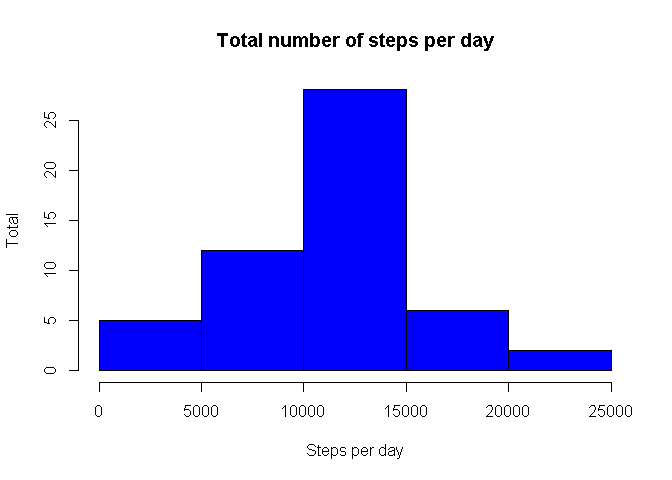
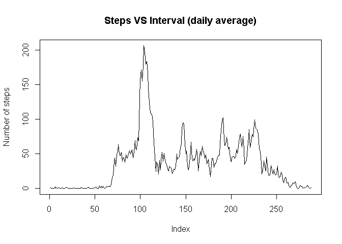
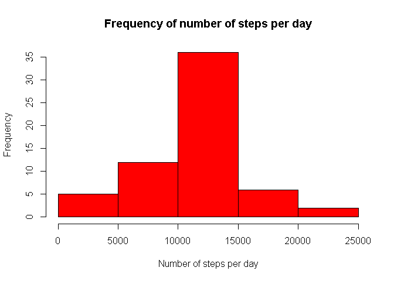
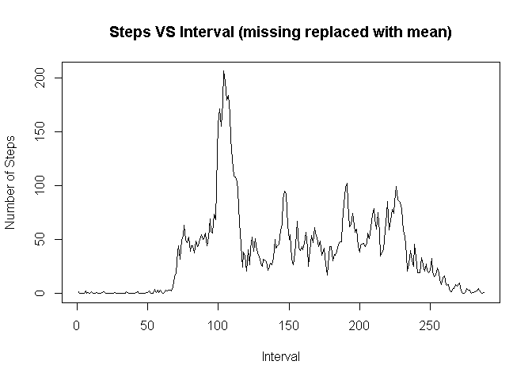
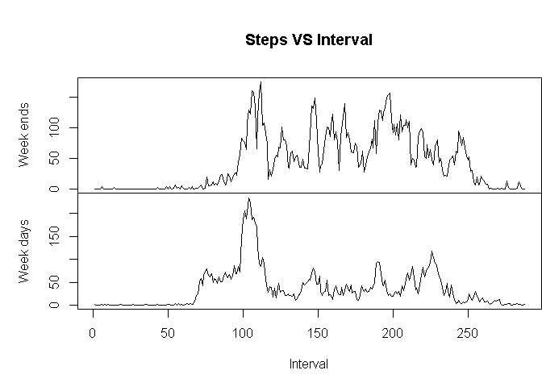

# homework reproducible research

###Introduction
It is now possible to collect a large amount of data about personal movement using activity monitoring devices such as a Fitbit, Nike Fuelband, or Jawbone Up. These type of devices are part of the "quantified self" movement - a group of enthusiasts who take measurements about themselves regularly to improve their health, to find patterns in their behavior, or because they are tech geeks. But these data remain under-utilized both because the raw data are hard to obtain and there is a lack of statistical methods and software for processing and interpreting the data.

This assignment makes use of data from a personal activity monitoring device. This device collects data at 5 minute intervals through out the day. The data consists of two months of data from an anonymous individual collected during the months of October and November, 2012 and include the number of steps taken in 5 minute intervals each day.


###Load and preprocess the data.

1. Set the correct R working directory with the setwd() function.

2. Load the data


```r
data <- read.csv("activity.csv")
```

#The mean of total number of steps taken per day

1. Histogram of the total number of steps taken per day
2. Mean and median of total number of steps taken per day


```r
stepsDaily <- tapply(data$steps, data$date, sum)
hist(stepsDaily, breaks = 6, main = "Total number of steps per day", 
    xlab = "Steps per day", ylab = "Total", col = "blue")
```

 
    

```r
stepsMeanDaily <- tapply(data$steps, data$date, mean, na.rm = T)
```

The mean number of steps per day is:


```r
mean(stepsDaily, na.rm=T)
```

```
## [1] 10766.19
```

The median number of steps per day is:


```r
median(stepsDaily, na.rm=T)
```

```
## [1] 10765
```

#The average daily activity pattern

1. Time series plot of the 5-min interval and the number of steps taken, averaged across all days


```r
stepsMeanPerInterval <- tapply(data$steps, data$interval, mean, na.rm = T)
plot(stepsMeanPerInterval, type = "l", main = ("Steps VS Interval (daily average)"), 
    ylab = "Number of steps")
```

 

The interval with the maximum number of steps:


```r
seq(along = stepsMeanPerInterval)[stepsMeanPerInterval == max(stepsMeanPerInterval)]
```

```
## [1] 104
```

#Dealing with missing values

1. Calculate and report the total number of missing values in the dataset (i.e. the total number of rows with NAs).

2. Devise a strategy for filling in all of the missing values in the dataset. The strategy does not need to be sophisticated. For example, you could use the mean/median for that day, or the mean for that 5-minute interval, etc.

3. Create a new dataset that is equal to the original dataset but with the missing data filled in.

4. Make a histogram of the total number of steps taken each day and Calculate and report the mean and median total number of steps taken per day. Do these values differ from the estimates from the first part of the assignment? What is the impact of imputing missing data on the estimates of the total daily number of steps?


```r
sum(as.numeric(is.na(data$steps)))
```

```
## [1] 2304
```


```r
tmp_stepsMeanPerInterval <- as.vector(stepsMeanPerInterval)
tmp_stepsMeanPerInterval <- rep(tmp_stepsMeanPerInterval, 61)
tmp_stepsMeanPerInterval[!is.na(data$steps)] = 1

tmp_dataTest <- as.vector(data$steps)
tmp_dataTest[is.na(tmp_dataTest)] = 1

data_NoMissing <- data
data_NoMissing$steps <- tmp_stepsMeanPerInterval * tmp_dataTest

stepsTotalPerDay_NoMissing <- tapply(data_NoMissing$steps, data_NoMissing$date, 
    sum)
hist(stepsTotalPerDay_NoMissing, breaks = 6, main = "Frequency of number of steps per day", 
    xlab = "Number of steps per day", ylab = "Frequency", col = "red")
```

 

Mean steps per day (missing replaced by mean)

```r
stepsMeanPerInterval_NoMissing <- tapply(data_NoMissing$steps,data_NoMissing$interval, mean)

mean(stepsTotalPerDay_NoMissing)
```

```
## [1] 10766.19
```

Median steps per day(missing replaced by the mean)

```r
median(stepsTotalPerDay_NoMissing)
```

```
## [1] 10766.19
```


```r
plot(stepsMeanPerInterval_NoMissing, type = "l", xlab = "Interval", ylab = "Number of Steps", 
    main = "Steps VS Interval (missing replaced with mean)")
```

 

# Difference in activity pattern between weekdays and weekends


```r
tmpLT <- as.POSIXlt(data$date, format = "%Y-%m-%d")
tmpWeekDays <- tmpLT$wday
tmpWeekDays[tmpWeekDays == 0] = 0
tmpWeekDays[tmpWeekDays == 6] = 0
tmpWeekDays[tmpWeekDays != 0] = 1
tmpWeekDaysFactor <- factor(tmpWeekDays, levels = c(0, 1))
# Add the factor variable to the data
data$WD <- tmpWeekDaysFactor
# Calculate the mean
stepsMeanPerWeekday <- tapply(data$steps, list(data$interval, data$WD), mean, 
    na.rm = T)

par(mfrow = c(2, 1))
# Display the 2 plots
with(data, {
    par(mai = c(0, 1, 1, 0))
    plot(stepsMeanPerWeekday[, 1], type = "l", main = ("Steps VS Interval"), 
        xaxt = "n", ylab = "Week ends")
    title = ("# of Steps v.s. Interval")
    par(mai = c(1, 1, 0, 0))
    plot(stepsMeanPerWeekday[, 2], type = "l", xlab = "Interval", ylab = "Week days")

})   
```

 

    
    
